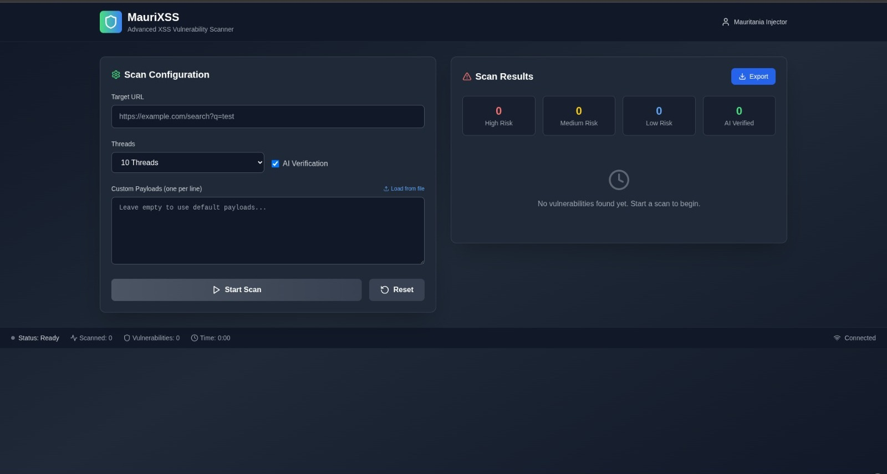

# MauriXSS 🚀 — Advanced XSS Exploration & Verification Tool

<p align="center">
  
  
  
</p>



---

## ⚔️ What is MauriXSS?

**MauriXSS** is a modern, AI-assisted, and modular **XSS vulnerability scanner** built from scratch with cutting-edge frontend technologies. Designed for professional **penetration testers**, **bug bounty hunters**, and **security researchers**, it enables precision testing, elegant UI feedback, and full control over the payloads and scanning process.

> 💥 This is not a proof-of-concept — it's a **proof of mastery**.

---

## 🧠 Why MauriXSS?

- 🔍 **Simulates real-world XSS attacks with AI validation**
- ⚙️ **Highly configurable**: Set threads, inject custom payloads, use file-based inputs
- 🌐 **Runs fully on the frontend** — fast, secure, portable
- 🧬 **Clean architecture** with Vite + TypeScript + Tailwind
- 📊 **Auto-classifies vulnerabilities** into high/medium/low risk

---

## 📦 Tech Stack

| Technology     | Purpose                              |
|----------------|---------------------------------------|
| `Vite.js`      | Ultra-fast frontend build system      |
| `TypeScript`   | Robust and maintainable codebase      |
| `Tailwind CSS` | Elegant, utility-based styling        |
| `Node.js`      | Dev dependencies only (no backend)    |

---

## 🧪 Key Features

- ✅ AI-verified XSS results
- 🧠 Smart payload injection engine
- 🧩 Support for custom or external payload lists
- 📦 Export scan results in one click
- 🔁 Multi-threaded scanning interface
- 🌙 Beautiful dark UI — optimized for night hackers 🕶️

---

## 🚀 Getting Started

```bash
# Clone the repo
git clone https://github.com/mauritaniacoder99/maurixss.git
cd maurixss

# Install dependencies
npm install

# Start the development server
npm run dev


Then open your browser at http://localhost:5173


📸 Screenshot
<p align="center">  </p>
💡 Use Cases

    🔐 Demonstrating XSS PoCs to clients or bug bounty platforms

    🧪 Training labs and workshops

    🏴‍☠️ Internal tools for bounty hunters

    📚 Educational resources for security students

👨‍💻 About the Author

    Crafted by mauritaniainjector, a Mauritanian cybersecurity engineer with deep expertise in offensive security, reverse engineering, and bug bounty exploitation.

📍 From the sands of Mauritania, this tool was born to redefine how XSS is demonstrated and validated.
⚠️ Legal Notice

This tool is provided for educational and authorized testing only. Any misuse is strictly prohibited. The developer is not responsible for unethical use or illegal activity.
⭐️ Like It?

Give it a ⭐️ to support the project. Your feedback drives future features and improvements.

    "True hacking is not about tools. It's about mastery. MauriXSS is mastery — in action." – mauritaniainjector


